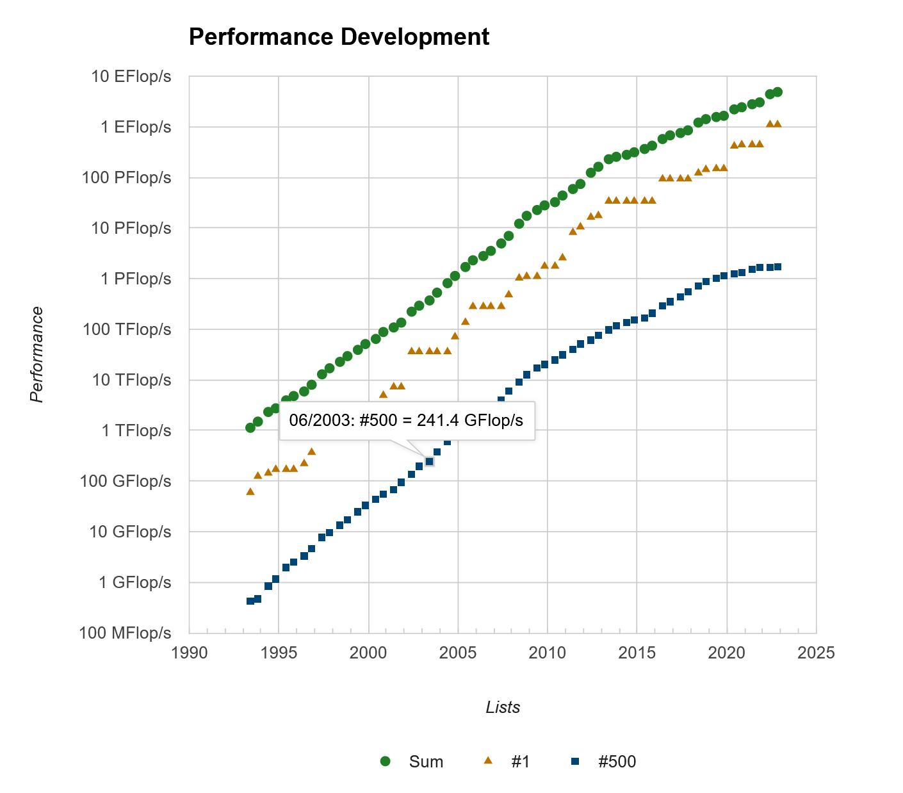

# How to run HPL/HPCG/IO500 in WSL

[TOC]

## 0. PC Info

|   Name    |                             Info                             |
| :-------: | :----------------------------------------------------------: |
|  Edition  | Windows 11 Pro Insider Preview  64-bit 22H2 (10.0, Build 1000.23451.1000.0)  (23451.ni_prerelease.230428-1438) |
| Processor | 12th Gen Intel(R) Core(TM) i7-12700H (14 Cores 20 CPUs), ~2.3GHz |
|  Memory   |               16384MB RAM + 18925MB Page File                |

## 1. HPL (High-Performance Linpack)

### 0. Info

|   Name   |                           Version                            |
| :------: | :----------------------------------------------------------: |
|    OS    | Ubuntu 22.04.2 LTS (GNU/Linux 5.15.90.1-microsoft-standard-WSL2 x86_64) |
|   GCC    |     gcc version 11.3.0 (Ubuntu 11.3.0-1ubuntu1~22.04.1)      |
| OpenMPI  |                            4.1.5                             |
| OpenBLAS |                            0.3.23                            |

### 1. Install WSL

1. In Windows 11, you can get WSL from [Microsoft Store](https://www.microsoft.com/p/ubuntu/9pdxgncfsczv).

2. Run Ubuntu from the start menu and set a username and password. When finished you will see output like following:

   ```bash
   Installing, this may take a few minutes...
   Please create a default UNIX user account. The username does not need to match your Windows username.
   For more information visit: https://aka.ms/wslusers
   Enter new UNIX username: hangyi
   New password:
   Retype new password:
   passwd: password updated successfully
   The operation completed successfully.
   Installation successful!
   To run a command as administrator (user "root"), use "sudo <command>".
   See "man sudo_root" for details.
   
   Welcome to Ubuntu 22.04.2 LTS (GNU/Linux 5.15.90.1-microsoft-standard-WSL2 x86_64)
   
    * Documentation:  https://help.ubuntu.com
    * Management:     https://landscape.canonical.com
    * Support:        https://ubuntu.com/advantage
   
   
   This message is shown once a day. To disable it please create the
   /home/hangyi/.hushlogin file.
   hangyi@DESKTOP-VHIQPUO:~$
   ```

3. You can use the following commands to view system information.

   ```bash
   uname -a && lsb_release -a
   ```

   Output like this, I use Ubuntu 22.04.2 LTS:

   ```bash
   Linux DESKTOP-VHIQPUO 5.15.90.1-microsoft-standard-WSL2 #1 SMP Fri Jan 27 02:56:13 UTC 2023 x86_64 x86_64 x86_64 GNU/Linux
   No LSB modules are available.
   Distributor ID: Ubuntu
   Description:    Ubuntu 22.04.2 LTS
   Release:        22.04
   Codename:       jammy
   ```

4. If you exit, you can run `wsl -d Ubuntu --cd ~` to return Ubuntu.

### 2. Install OpenMPI and OpenBLAS

0. If you are not confident about your network situation, it is recommended to configure a mirror source.

     ```bash
     sudo sed -i 's@//.*.ubuntu.com@//mirrors.ustc.edu.cn@g' /etc/apt/sources.list
     ```

     Running the above command will change your source address to the USTC mirror source. You may need to enter the password you set during the WSL installation.

1. Install the compile tools.

   ```bash
   sudo apt update && sudo apt install -y build-essential gfortran
   ```
2. Installing using the package manager should be the easy way out, but the version may be older.

   ```bash
   sudo apt install -y libopenmpi-dev libopenblas-dev
   ```

3. Test if the installation was successful:

   ```bash
   gcc --version && gfortran --version && mpirun --version && find /usr -name libmpi.so && find /usr -name libopenblas.a
   ```

   If the outputs like the following, it's OK:

   ```bash
   gcc (Ubuntu 11.3.0-1ubuntu1~22.04) 11.3.0
   Copyright (C) 2021 Free Software Foundation, Inc.
   This is free software; see the source for copying conditions.  There is NO
   warranty; not even for MERCHANTABILITY or FITNESS FOR A PARTICULAR PURPOSE.
   
   GNU Fortran (Ubuntu 11.3.0-1ubuntu1~22.04) 11.3.0
   Copyright (C) 2021 Free Software Foundation, Inc.
   This is free software; see the source for copying conditions.  There is NO
   warranty; not even for MERCHANTABILITY or FITNESS FOR A PARTICULAR PURPOSE.
   
   mpirun (Open MPI) 4.1.2
   
   Report bugs to http://www.open-mpi.org/community/help/
   /usr/lib/x86_64-linux-gnu/libmpi.so
   /usr/lib/x86_64-linux-gnu/libopenblas.a
   ```

### 3. Compile HPL

1. Get HPL from https://www.netlib.org/benchmark/hpl.

   ```bash
   wget https://www.netlib.org/benchmark/hpl/hpl-2.3.tar.gz
   ```

2. Unpack file.

   ```bash
   tar -xzvf hpl-2.3.tar.gz && cd hpl-2.3
   ```

3. Copy a sample configuration from the Setups folder.

   ```bash
   cp setup/Make.Linux_PII_CBLAS ./
   ```

4. Edit the Make.Linux_PII_CBLAS file. You can use editors like vi/vim/gedit/nano, I'll use nano as an example.

   ```bash
   nano Make.Linux_PII_CBLAS
   ```

   And change the following lines:

   ```bash
   TOPdir       = $(HOME)/hpl-2.3
   
   MPdir        = /usr/lib/x86_64-linux-gnu/openmpi
   MPlib        = $(MPdir)/lib/libmpi.so
   
   LAdir        = /usr/lib/x86_64-linux-gnu/openblas-pthread
   LAlib        = $(LAdir)/libopenblas.a $(LAdir)/libbblas.a
   
   CC           = /usr/bin/mpicc
   LINKER       = /usr/bin/gfortran
   ```

   For nano, `Ctrl + o` and `Enter` to save, `Ctrl + x` to exit.

   If you have other MPI or BLAS libraries installed, you also need to modify `MPdir` `MPlib` and `LAdir` `LAlib` to the corresponding installation path and library files.

5. Compile HPL,  `-j8` is the number of threads you want to open, a larger number will speed up compilation.

   ```bash
   make arch=Linux_PII_CBLAS -j8
   ```

   Waiting for the end of compilation, if everything is fine with your configuration, you can find `HPL.dat` and `xhpl` under `bin/Linux_PII_CBLAS`.

   If you don't find `xhpl` in `bin`, but can find in `testing`, you may have entered the wrong path. If you can't find even in `tesing` directory, there may be a configuration problem, please check the `Make.Linux_PII_CBLAS` file.

6. To run the sample HPL test, we use `mpirun` to run it in multiple threads, the number after `-np` is the number of processes to run.

   ```bash
   cd bin/Linux_PII_CBLAS
   touch HPL.out
   mpirun -np 8 xhpl
   ```
   
   You will get a lot of output, just a small snippet here.
   
   ```bash
   ================================================================================
   HPLinpack 2.3  --  High-Performance Linpack benchmark  --   December 2, 2018
   Written by A. Petitet and R. Clint Whaley,  Innovative Computing Laboratory, UTK
   Modified by Piotr Luszczek, Innovative Computing Laboratory, UTK
   Modified by Julien Langou, University of Colorado Denver
   ================================================================================
   
   An explanation of the input/output parameters follows:
   T/V    : Wall time / encoded variant.
   N      : The order of the coefficient matrix A.
   NB     : The partitioning blocking factor.
   P      : The number of process rows.
   Q      : The number of process columns.
   Time   : Time in seconds to solve the linear system.
   Gflops : Rate of execution for solving the linear system.
   
   The following parameter values will be used:
   
   N      :      29       30       34       35
   NB     :       1        2        3        4
   PMAP   : Row-major process mapping
   P      :       2        1        4
   Q      :       2        4        1
   PFACT  :    Left    Crout    Right
   NBMIN  :       2        4
   NDIV   :       2
   RFACT  :    Left    Crout    Right
   BCAST  :   1ring
   DEPTH  :       0
   SWAP   : Mix (threshold = 64)
   L1     : transposed form
   U      : transposed form
   EQUIL  : yes
   ALIGN  : 8 double precision words
   
   --------------------------------------------------------------------------------
   
   - The matrix A is randomly generated for each test.
   - The following scaled residual check will be computed:
         ||Ax-b||_oo / ( eps * ( || x ||_oo * || A ||_oo + || b ||_oo ) * N )
   - The relative machine precision (eps) is taken to be               1.110223e-16
   - Computational tests pass if scaled residuals are less than                16.0
   
   ================================================================================
   T/V                N    NB     P     Q               Time                 Gflops
   --------------------------------------------------------------------------------
   WR00L2L2          29     1     2     2               0.00             1.9114e-02
   HPL_pdgesv() start time
   
   HPL_pdgesv() end time
   
   --------------------------------------------------------------------------------
   ||Ax-b||_oo/(eps*(||A||_oo*||x||_oo+||b||_oo)*N)=   1.88218349e-02 ...... PASSED
   
   ...
   ...
   ...
   
   ================================================================================
   T/V                N    NB     P     Q               Time                 Gflops
   --------------------------------------------------------------------------------
   WR00R2R4          35     4     4     1               0.00             5.9052e-01
   HPL_pdgesv() start time
   
   HPL_pdgesv() end time
   
   --------------------------------------------------------------------------------
   ||Ax-b||_oo/(eps*(||A||_oo*||x||_oo+||b||_oo)*N)=   1.99396688e-02 ...... PASSED
   ================================================================================
   
   Finished    864 tests with the following results:
               864 tests completed and passed residual checks,
                 0 tests completed and failed residual checks,
                 0 tests skipped because of illegal input values.
   --------------------------------------------------------------------------------
   
   End of Tests.
   ================================================================================
   ```
   
   We need to focus on the `Gflops` value, my maximum value in the sample configuration is `1.3211e+00`.

### 4. Performance Tuning.

#### 0. It is a constant process of experimentation and requires patience.

#### 1. Adjust the HPL.dat file

   You can refer https://www.netlib.org/benchmark/hpl/tuning.html to adjust the HPL.dat file, or generate one directly from https://www.advancedclustering.com/act_kb/tune-hpl-dat-file.

   |        Input         | Num  |
   | :------------------: | :--: |
   |        Nodes         |  1   |
   |    Cores per Node    |  1   |
   | Memory per Node (MB) | 512  |
   |   Block Size (NB)    | 192  |

   Output:

   ```bash
   HPLinpack benchmark input file
   Innovative Computing Laboratory, University of Tennessee
   HPL.out      output file name (if any) 
   6            device out (6=stdout,7=stderr,file)
   1            # of problems sizes (N)
   7296         Ns
   1            # of NBs
   192          NBs
   0            PMAP process mapping (0=Row-,1=Column-major)
   1            # of process grids (P x Q)
   1            Ps
   1            Qs
   16.0         threshold
   1            # of panel fact
   2            PFACTs (0=left, 1=Crout, 2=Right)
   1            # of recursive stopping criterium
   4            NBMINs (>= 1)
   1            # of panels in recursion
   2            NDIVs
   1            # of recursive panel fact.
   1            RFACTs (0=left, 1=Crout, 2=Right)
   1            # of broadcast
   1            BCASTs (0=1rg,1=1rM,2=2rg,3=2rM,4=Lng,5=LnM)
   1            # of lookahead depth
   1            DEPTHs (>=0)
   2            SWAP (0=bin-exch,1=long,2=mix)
   64           swapping threshold
   0            L1 in (0=transposed,1=no-transposed) form
   0            U  in (0=transposed,1=no-transposed) form
   1            Equilibration (0=no,1=yes)
   8            memory alignment in double (> 0)
   ##### This line (no. 32) is ignored (it serves as a separator). ######
   0                               Number of additional problem sizes for PTRANS
   1200 10000 30000                values of N
   0                               number of additional blocking sizes for PTRANS
   40 9 8 13 13 20 16 32 64        values of NB
   ```

   Modify HPL.dat to the above value and run `xhpl` again.

   ```bash
   mpirun -np 4 xhpl
   ```

   Output (partial):

   ```bash
   ================================================================================
   HPLinpack 2.3  --  High-Performance Linpack benchmark  --   December 2, 2018
   Written by A. Petitet and R. Clint Whaley,  Innovative Computing Laboratory, UTK
   Modified by Piotr Luszczek, Innovative Computing Laboratory, UTK
   Modified by Julien Langou, University of Colorado Denver
   ================================================================================
   
   An explanation of the input/output parameters follows:
   T/V    : Wall time / encoded variant.
   N      : The order of the coefficient matrix A.
   NB     : The partitioning blocking factor.
   P      : The number of process rows.
   Q      : The number of process columns.
   Time   : Time in seconds to solve the linear system.
   Gflops : Rate of execution for solving the linear system.
   
   The following parameter values will be used:
   
   N      :    7296
   NB     :     192
   PMAP   : Row-major process mapping
   P      :       1
   Q      :       1
   PFACT  :   Right
   NBMIN  :       4
   NDIV   :       2
   RFACT  :   Crout
   BCAST  :  1ringM
   DEPTH  :       1
   SWAP   : Mix (threshold = 64)
   L1     : transposed form
   U      : transposed form
   EQUIL  : yes
   ALIGN  : 8 double precision words
   
   --------------------------------------------------------------------------------
   
   - The matrix A is randomly generated for each test.
   - The following scaled residual check will be computed:
         ||Ax-b||_oo / ( eps * ( || x ||_oo * || A ||_oo + || b ||_oo ) * N )
   - The relative machine precision (eps) is taken to be               1.110223e-16
   - Computational tests pass if scaled residuals are less than                16.0
   
   ================================================================================
   T/V                N    NB     P     Q               Time                 Gflops
   --------------------------------------------------------------------------------
   WR11C2R4        7296   192     1     1               1.82             1.4243e+02
   HPL_pdgesv() start time Fri May 19 23:52:43 2023
   
   HPL_pdgesv() end time   Fri May 19 23:52:45 2023
   
   --------------------------------------------------------------------------------
   ||Ax-b||_oo/(eps*(||A||_oo*||x||_oo+||b||_oo)*N)=   3.98844764e-03 ...... PASSED
   ================================================================================
   
   Finished      1 tests with the following results:
                 1 tests completed and passed residual checks,
                 0 tests completed and failed residual checks,
                 0 tests skipped because of illegal input values.
   --------------------------------------------------------------------------------
   
   End of Tests.
   ================================================================================
   ```

   You can see that the score has improved by `10781%`.

   Then I modify these:

   ```bash
   file         device out (6=stdout,7=stderr,file)
   2            # of problems sizes (N)
   16384 20352  Ns
   0 1 2        PFACTs (0=left, 1=Crout, 2=Right)
   2 8          NBMINs (>= 1)
   0 1 2        RFACTs (0=left, 1=Crout, 2=Right)
   3 2          BCASTs (0=1rg,1=1rM,2=2rg,3=2rM,4=Lng,5=LnM)
   ```

   Now run it again and get the output:

   ```bash
   ================================================================================
   T/V                N    NB     P     Q               Time                 Gflops
   --------------------------------------------------------------------------------
   WR13L2L2       16384   192     1     1              10.85             2.7028e+02
   --------------------------------------------------------------------------------
   ||Ax-b||_oo/(eps*(||A||_oo*||x||_oo+||b||_oo)*N)=   2.48156500e-03 ...... PASSED
   ================================================================================
   T/V                N    NB     P     Q               Time                 Gflops
   --------------------------------------------------------------------------------
   WR13L2L2       20352   192     1     1              20.03             2.8064e+02
   --------------------------------------------------------------------------------
   ||Ax-b||_oo/(eps*(||A||_oo*||x||_oo+||b||_oo)*N)=   1.90299920e-03 ...... PASSED
   ================================================================================
   ```

   You can see that the score has improved by `22253%` than the first. The result of `2.8064e+02 Gflops ` can enter the [Top500](https://www.top500.org/statistics/perfdevel) in `2003.06`.



#### 2. Change versions

You can install other versions by compiling from source, the version installed from source will be newer.

   ```bash
   # For OpenMPI
   cd ~ && wget https://download.open-mpi.org/release/open-mpi/v4.1/openmpi-4.1.5.tar.gz
   tar -xzvf openmpi-4.1.5.tar.gz && cd openmpi-4.1.5
   ./configure --prefix=/usr/local/openmpi
   sudo make all install -j8
   echo "export PATH=/usr/local/openmpi/bin:\$PATH" >> ~/.bashrc
   echo "export LD_LIBRARY_PATH=/usr/local/openmpi/lib:\$LD_LIBRARY_PATH" >> ~/.bashrc
   source ~/.bashrc
   
   # For OpenBLAS
   cd ~ && wget https://github.com/xianyi/OpenBLAS/releases/download/v0.3.23/OpenBLAS-0.3.23.tar.gz # If there is a network problem, please switch to https://ghproxy.com/https://github.com/xianyi/OpenBLAS/releases/download/v0.3.23/OpenBLAS-0.3.23.tar.gz
   tar -xzvf OpenBLAS-0.3.23.tar.gz && cd OpenBLAS-0.3.23
   make FC=gfortran -j8
   sudo make PREFIX=/usr/local/openblas install
   
   # For MPL
   
   cd ~ && wget https://www.netlib.org/benchmark/hpl/hpl-2.0.tar.gz
   tar -xzvf hpl-2.0.tar.gz && cd hpl-2.0
   ```

You need to change the `MPdir` and `LAdir` to the corresponding installation paths, like this:

   ```bash
   TOPdir       = $(HOME)/hpl-2.0
   
   MPdir        = /usr/local/openmpi
   MPlib        = $(MPdir)/lib/libmpi.so
   
   LAdir        = /usr/local/openblas
   LAlib        = $(LAdir)/lib/libopenblas.a
   
   CC           = /usr/local/openmpi/bin/mpicc
   LINKER       = /usr/local/openmpi/bin/mpif77
   ```

Then recompile MPL and test again.

   ```bash
   cp ~/hpl-2.3/bin/Linux_PII_CBLAS/HPL-Tuning.dat ~/hpl-2.0/bin/Linux_PII_CBLAS/HPL.dat
   cd ~/hpl-2.0/bin/Linux_PII_CBLAS
   mpirun -np 8 xhpl
   ```

Output:

```bash
================================================================================
T/V                N    NB     P     Q               Time                 Gflops
--------------------------------------------------------------------------------
WR13L2L2       16384   192     1     1              15.90              1.844e+02
--------------------------------------------------------------------------------
||Ax-b||_oo/(eps*(||A||_oo*||x||_oo+||b||_oo)*N)=        0.0022339 ...... PASSED
================================================================================
T/V                N    NB     P     Q               Time                 Gflops
--------------------------------------------------------------------------------
WR13L2L2       20352   192     1     1              35.05              1.604e+02
--------------------------------------------------------------------------------
||Ax-b||_oo/(eps*(||A||_oo*||x||_oo+||b||_oo)*N)=        0.0019320 ...... PASSED
================================================================================
```

~~It seems the results are even worse:>~~

#### 5. In Windows

If you are on windows, you can simply install [Intel® oneAPI Base Toolkit](https://www.intel.com/content/www/us/en/developer/tools/oneapi/base-toolkit-download.html?operatingsystem=window&distributions=online&version=2023.1) to get `benchmarks` and [Intel® oneAPI HPC Toolkit](https://www.intel.com/content/www/us/en/developer/tools/oneapi/hpc-toolkit-download.html?operatingsystem=window&distributions=online) to get `mpiexec`. 

After installation, Run the terminal in administrator mode and go to the directory `<oneAPI Install path>\mkl\2023.1.0\benchmarks\mp_linpack`.

Then run `runme_intel64_dynamic.bat` Or run `xhpl_intel64_dynamic.exe` directly.

```bash
This is a SAMPLE run script. Change it to reflect the correct
number of CPUs/threads, number of nodes, MPI processes per node, etc..
This run started on:
05/20/2023 Sat
01:02
Capturing output into: xhpl_intel64_dynamic_outputs.txt

Done:
05/20/2023 Sat
01:02
```

And you will get a HPL report `xhpl_intel64_dynamic_outputs.txt` in the current directory. 

Then you can refer to the performance tuning guide above to improve your score.

## 3. HPCG Test

1. Get source from https://github.com/hpcg-benchmark/hpcg.

   ```bash
   git clone https://github.com/hpcg-benchmark/hpcg.git && cd hpcg
   ```

2. Copy example config.

   ```bash
   cp setup/Make.Linux_MPI ./
   ```

3. Modify Configuration, using `nano Make.Linux_MPI`.
   ```bash
   TOPdir       = $(HOME)/hpcg
   
   MPdir        = /usr/lib/x86_64-linux-gnu/openmpi
   MPinc        = -I$(MPdir)/include
   MPlib        = $(MPdir)/lib/libmpi.so
   
   HPCG_OPTS     = -DHPCG_NO_OPENMP -DHPCG_DETAILED_TIMING
   ```

4. Build from source. If the build fails, delete the folder and download the source code again.
   ```bash
   make arch=Linux_MPI -j4
   ```

5. Now you can find the `xhpcg` and `hpcg.dat` files in the bin directory

6. Test HPCG.

   ```bash
   cd bin
   mpirun -np 4 xhpcg --nx=16 --rt=1800
   # The test will last for 30 minutes (1800 seconds)
   ```

   Output in file `hpcg<identifier>.txt` and `HPCG-Benchmark_3.1_<identifier>.txt`:

   ```bash
   $ cat HPCG-Benchmark_3.1_<identifier>.txt | grep GFLOP
   GFLOP/s Summary=
   GFLOP/s Summary::Raw DDOT=1.46162
   GFLOP/s Summary::Raw WAXPBY=18.9513
   GFLOP/s Summary::Raw SpMV=10.583
   GFLOP/s Summary::Raw MG=8.18653
   GFLOP/s Summary::Raw Total=7.88411
   GFLOP/s Summary::Total with convergence overhead=7.88411
   GFLOP/s Summary::Total with convergence and optimization phase overhead=7.55894
   Final Summary::HPCG result is VALID with a GFLOP/s rating of=7.55894
   ```

   Result is `7.55894 GFLOP/s`

7. Performance Tuning

   See https://github.com/hpcg-benchmark/hpcg/blob/master/TUNING and modify the `HPCG.dat`
   
   ```bash
   HPCG benchmark input file
   Sandia National Laboratories; University of Tennessee, Knoxville
   120 120 120
   120
   ```
   
   And run again.

## 4. IO500 Test

1. Clone the `io500` source.

   ```bash
   git clone https://github.com/IO500/io500.git && cd io500
   ```

2.  To Retrieve the required packages and compile the library version, run:

   ```bash
   sudo apt install pkg-config # to solve autoconf errors
   ./prepare.sh
   ```

   When it’s OK,output:

   ```bash
   OK: All required software packages are now prepared
   ior  md-workbench  mdtest  pfind
   ```

3. In order to create a new INI file with all the options, you can execute:

   ```bash
   ./io500 --list > config-all.ini
   ```

4. (Optional) Modify config-all.ini (My disk space is not enough, you may need not modify).

   ```ini
   [ior-easy]
   blockSize = 100m
   
   [mdtest-easy]
   n = 100
   
   [ior-hard]
   segmentCount = 100
   
   [find-hard]
   pfind-queue-length = 100
   ```

5. Then you can running the io500 test:

   ```bash
   mpiexec -np 8 ./io500 config-all.ini
   ```

   Output:

   ```bash
   IO500 version io500-isc23 (standard)
   ERROR INVALID (src/phase_dbg.c:15) stonewall-time < 300s
   ERROR INVALID (src/phase_ior.c:24) Write phase needed 1.370603s instead of stonewall 5s. Stonewall was hit at 0.2s
   ERROR INVALID (src/main.c:437) Runtime of phase (1.379476) is below stonewall time. This shouldn't happen!
   ERROR INVALID (src/main.c:443) Runtime is smaller than expected minimum runtime
   [RESULT]       ior-easy-write        0.570005 GiB/s : time 1.379 seconds [INVALID]
   ERROR INVALID (src/main.c:437) Runtime of phase (1.056533) is below stonewall time. This shouldn't happen!
   ERROR INVALID (src/main.c:443) Runtime is smaller than expected minimum runtime
   [RESULT]    mdtest-easy-write       15.711578 kIOPS : time 1.057 seconds [INVALID]
   [      ]            timestamp        0.000000 kIOPS : time 0.000 seconds
   ERROR INVALID (src/phase_ior.c:24) Write phase needed 0.484803s instead of stonewall 5s. Stonewall was hit at 0.0s
   ERROR INVALID (src/main.c:437) Runtime of phase (0.485622) is below stonewall time. This shouldn't happen!
   ERROR INVALID (src/main.c:443) Runtime is smaller than expected minimum runtime
   [RESULT]       ior-hard-write        0.072243 GiB/s : time 0.486 seconds [INVALID]
   ERROR INVALID (src/main.c:443) Runtime is smaller than expected minimum runtime
   [RESULT]    mdtest-hard-write       56.509355 kIOPS : time 8.147 seconds [INVALID]
   [RESULT]                 find     2339.353769 kIOPS : time 0.173 seconds
   [RESULT]        ior-easy-read       14.772937 GiB/s : time 0.057 seconds
   [RESULT]     mdtest-easy-stat     2115.664061 kIOPS : time 1.002 seconds
   [RESULT]        ior-hard-read       18.307577 GiB/s : time 0.002 seconds
   [RESULT]     mdtest-hard-stat     7693.419492 kIOPS : time 1.059 seconds
   [RESULT]   mdtest-easy-delete      481.067125 kIOPS : time 1.003 seconds
   [RESULT]     mdtest-hard-read     1630.211454 kIOPS : time 1.252 seconds
   [RESULT]   mdtest-hard-delete      145.488834 kIOPS : time 3.870 seconds
   [SCORE ] Bandwidth 1.826809 GiB/s : IOPS 499.212193 kiops : TOTAL 30.198765 [INVALID]
   
   The result files are stored in the directory: ./results/<date>-<time>
   ```

   Why is `[INVALID]`, because the running time is not enough for 300 seconds :).

6. Performance Tuning.

   Modify the `config-all.ini`

   ```ini
   [ior-easy]
   blockSize = 9920000m
   
   [mdtest-easy]
   n = 1000000
   
   [ior-hard]
   segmentCount = 10000000
   
   [find-hard]
   pfind-queue-length = 10000
   ```

   And run it again.

## 5. Reference

> 1. https://chat.openai.com
> 2. https://www.deepl.com/translator
> 3. https://www.open-mpi.org
> 4. https://www.netlib.org/benchmark/hpl
> 5. https://www.hpcg-benchmark.org
> 6. https://github.com/hpcg-benchmark/hpcg
> 7. https://github.com/IO500/io500

## -1. Advices

1. Don't keep things until the last day :) !!!
